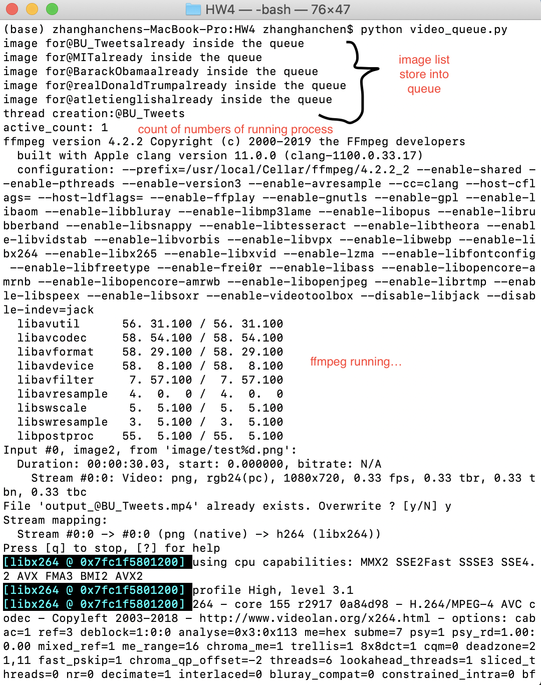

# REST-API Service-hanchenzhang: Integration of Video Creation Module

This is the EC500 HW5 REST-API from Hanchen Zhang: Twitter Summarizer Rest-service

# Assignment Announcement:
Main Exercise:  Integrate hw4 module to become a RESTFUL system, Deploy your system to free AWS services

# Introduction to Hanchen's video generation package.
The file videoHW4.py is the main function file that contains:

Twitterfeed(): carwling text from specified twitter user based on tweepy (API).
createpng(): put each text into png image that stores in the folder image.github
video_convertion() grabbing images from the image folder and generate video that display each frame for 3 seconds. The video generation command are all based on ffmpeg. The root directory contains a file "output_@BU_Tweets.mp4" is shown as example.

# The Queue:
The file videoqueue.py create a queue that works for a "brain" that control the running of functions in the videoHW4.py.
The size of the queue generated from the videoqueue.py is equal to the number of input user accounts.

This function set an arbitary number which is the maximum number that the threading could process. Currently this number is set to 2, Therefore if the threading already runs 2 functions. The new threads will put back to the queue and wait when there are extra space.

# The Test:
The file testqueue.py is the pytest running functions. The testing receive return code of 1 if all videos are created. For any invalid twitter user name, the testing receive return code of 0.

# Instruction of Running the package:
1. git clone the project
2. Apply twitter developer api key and substitute the key in the key file from the root directory
3. pip install required dependency shown in the requirement.txt
4. running videoqueue.py
